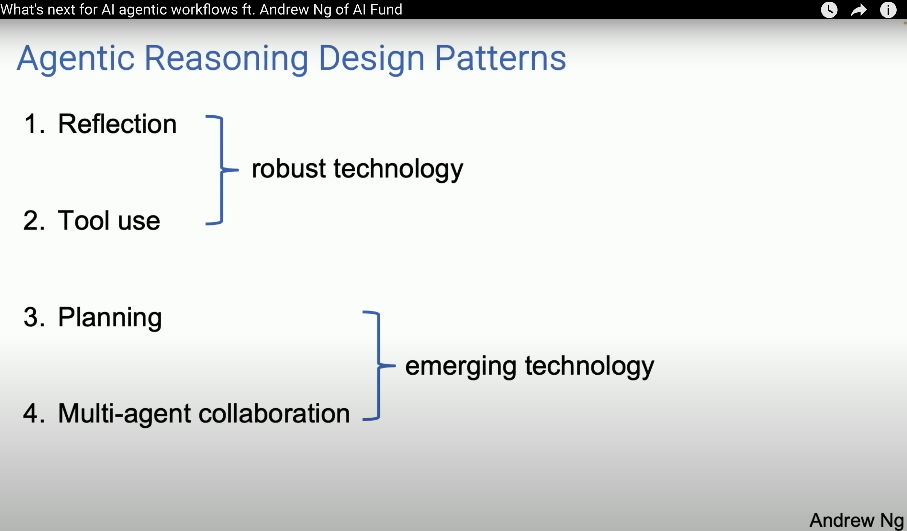
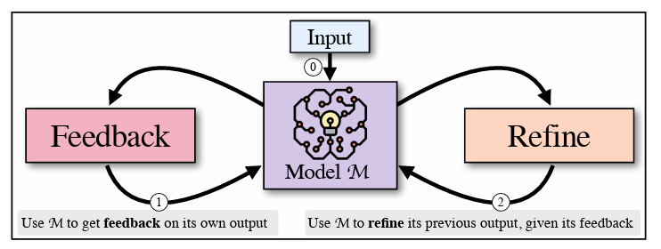
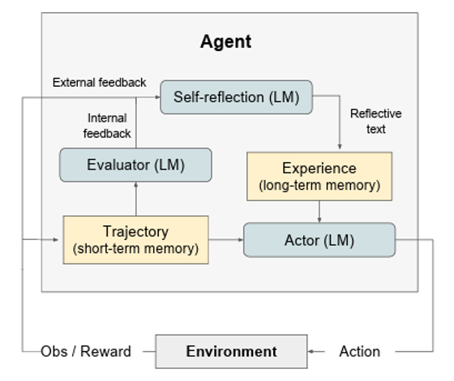

## Agent设计模式

吴恩达在一次技术分享中，提出了Agent的四种设计模式：

### Tool Use & Planning

使用 ICL 提升目标以及特征识别准确率

引入RAG，解决提问无背景知识的问题

优化 Tool Schema定义

Query Rewrite优化

### Reflection

1. Self-Refine: 一种迭代式的Self-Refine算法，在FEEDBACK 和 REFINE 两个生成式阶段进行选择

2. Reflexion：使用verbal reinforcement 来帮助代理从以前的失败中吸取教训

### multi-agent协同

按照业务维度拆分Agent，增加意图识别Agent

## 参考

1. https://www.youtube.com/watch?v=sal78ACtGTc： What's next for AI agentic workflows ft. Andrew Ng of AI Fund
