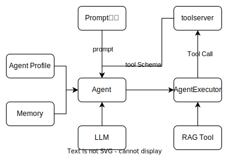

## Agent架构设计

Agent的组成：Planning(规划)、Memory（记忆）模块、Tools模块、Action模块。
+ Memory模块：主要用于存储agent执行中需要的一些数据，比如多轮对话等
+ Planning模块：主要是基于LLM进行推理和规划
+ Tools模块：提供外部能力的工具集合
+ Action模块：负责根据规划的输出来调用Tool。

Agent的核心能力如图：

