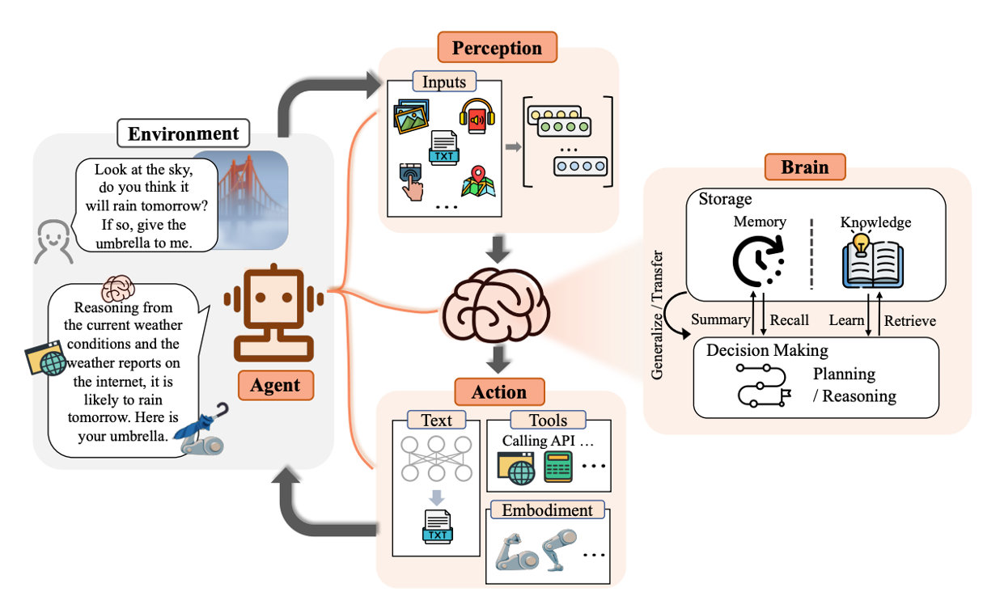
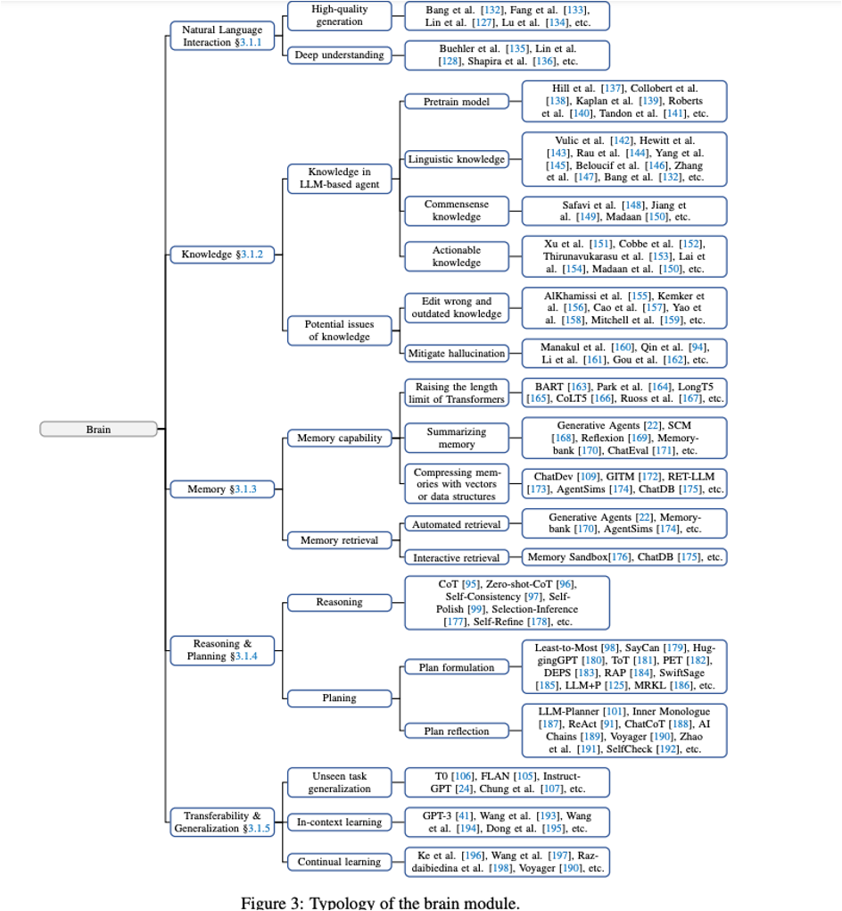
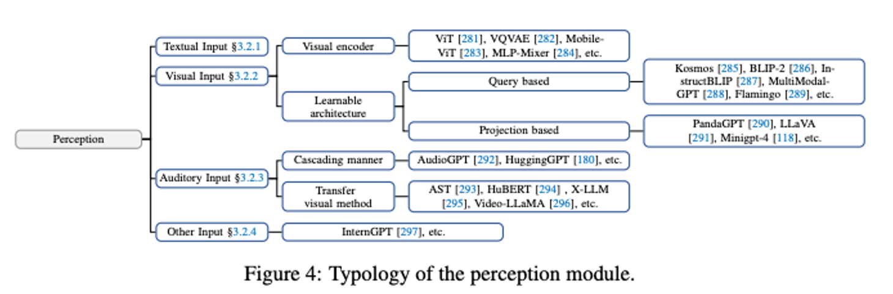
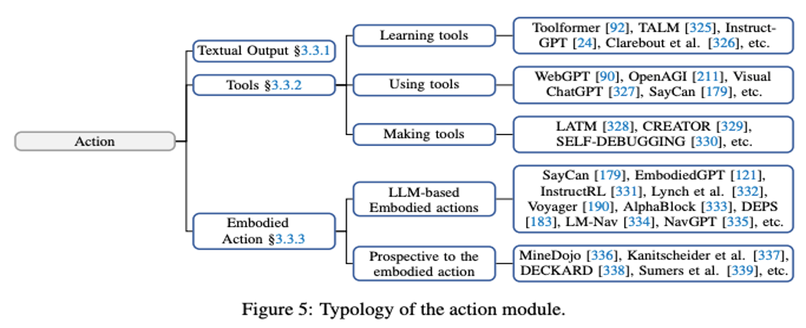

# Agent基础简介

## Agent的技术演变史

Symbolic Agent：采用逻辑规则和符号表示来封装知识和推理过程。
Reactive Agent：关注Agent和其Environment之间的交互，强调快速和实时响应。
RL-based Agent：关注如何让Agent通过与环境的交互进行学习，使其在特定任务中获得最大的累积奖励，比如AlphaGo
Agent with transfer learning and meta learning
LLM-based Agent：更强大的Agent，LLM具有自主性、反应性（Reactivity）、主动性（Pro-activeness）、社会能力。

## LLM-based Agent

LLM-based Agent包含Brain模块、Perception模块、Action模块，如图所示：

### Brain模块

Brain模块负责记忆、思考和决策等基本任务。Brain模块依赖LLM进行工作。

Brain的运动机制大概为：从内部信息通路接受 Perception 模块传来的输入 -> 将输入作为参数，从模块内的知识和记忆检索 -> 综合输入和检索出的数据信息进行推理和计划 -> 从内部信息通路输出Action序列到Action模块，并且进行模块内部知识和记忆的更新。

Brain模块有5个要素：自然语言交互、知识、记忆、推理和规划、可迁移性和通用性。

### Perception 模块

感知模块的核心目的是将Agent的感知空间从纯文字领域扩展到包括文字、听觉和视觉模式在内的多模态领域。
感知模块支持文本输入、视觉输入、听觉输入以及其他输入。

### Action模块

Action模块负责接收Brain模块发送的Action序列，并执行与环境互动的Action。使用Tool可以增强Agent的能力。

LLM-based Agent不仅需要使用工具，而且非常适合工具集成。LLM 利用通过预训练过程和 CoT 提示积累的丰富世界知识，
在复杂的交互环境中表现出了非凡的推理和决策能力，这有助于Agent以适当的方式分解和处理用户指定的任务。

此外，LLMs 在意图理解和其他方面也显示出巨大潜力。当Agent与工具相结合时，可以降低工具使用的门槛，从而充分释放人类用户的创造潜能。

综述：
+ https://lilianweng.github.io/posts/2023-06-23-agent/
+ The Rise and Potential of Large Language Model Based Agents: A Survey: https://arxiv.org/pdf/2309.07864.pdf
+ A Survey on Large Language Model based Autonomous Agents: https://arxiv.org/abs/2308.11432
+ Large Language Model based Multi-Agents: A Survey of Progress and Challenges

## 参考

1. https://zhuanlan.zhihu.com/p/656676717 《综述：全新大语言模型驱动的Agent》
2. https://zhuanlan.zhihu.com/p/671599535
3. https://blog.x-agent.net/blog/xagent/
4. https://python.langchain.com/
