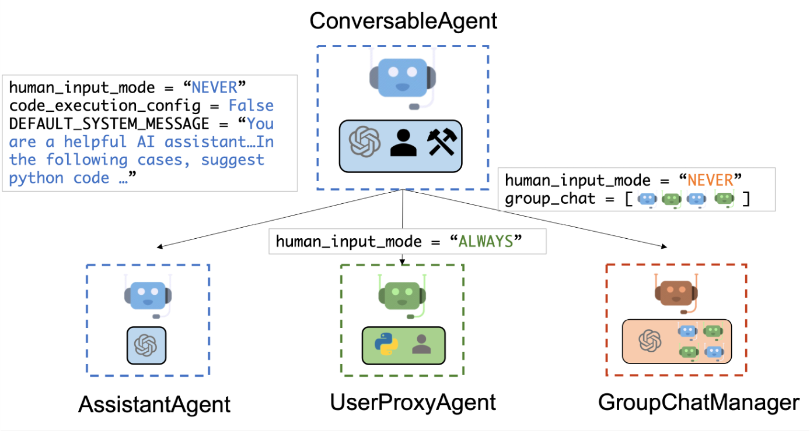
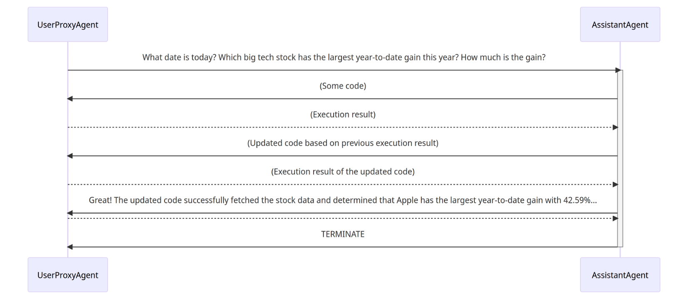
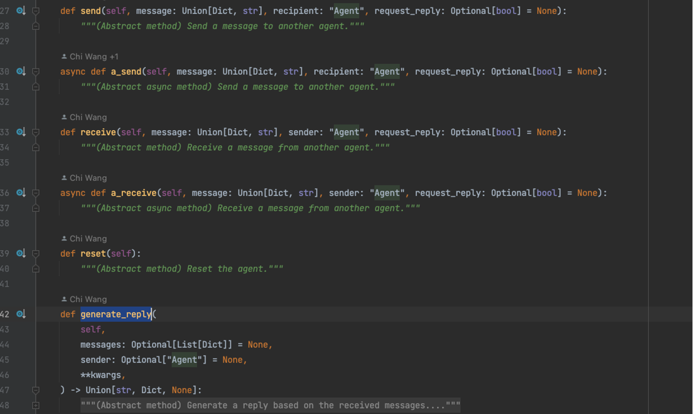
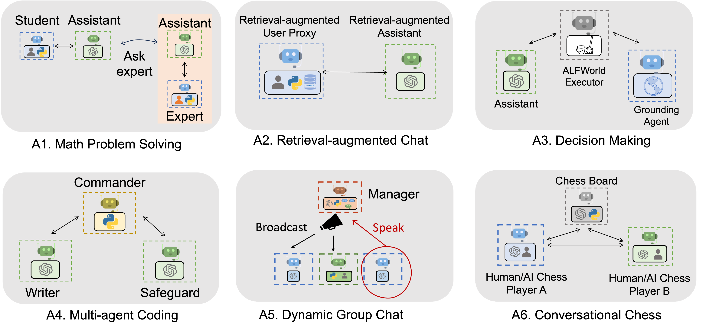

## AutoGen

微软开源的multi-Agent Conversation框架，支持使用多个Agent来开发LLM应用，Agent之间通过对话来完成任务。Agent是可定制的、可对话的、并且无缝地允许人类参与。

autoGen支持下一代大模型应用开发。特性：
+ 多Agent对话框架
+ 可以构建多样化的应用程序
+ 增强的LLM推理和优化：支持增强的LLM推理API

AutoGen 是一个框架，支持使用多个代理来开发 LLM 应用程序，这些代理可以相互对话来完成任务。AutoGen 代理是可定制的、可对话的，并且无缝地允许人类参与。他们可以采用LLM、human inputs和tools组合的各种模式运作。

AutoGen 可以轻松构建基于多代理对话的下一代 LLM 应用程序。它简化了复杂的 LLM 工作流程的编排、自动化和优化。它最大限度地提高了 LLM 模型的性能并克服了它们的弱点。
它支持复杂工作流程的多种对话模式。借助可定制和可对话的代理，开发人员可以使用 AutoGen 构建各种涉及对话自主性、代理数量和代理对话拓扑的对话模式。
它提供了一系列具有不同复杂性的工作系统。这些系统涵盖各种领域和复杂性的广泛应用。这演示了 AutoGen 如何轻松支持不同的对话模式。
AutoGen 提供增强的 LLM 推理。它提供 API 统一和缓存等实用程序，以及错误处理、多配置推理、上下文编程等高级使用模式。

默认实现的Agent实例：


Agent对话的交互流程为：


核心代码:
+ autogen
+ noteboook
+ samples
+ tests

## 代码

[Agent](https://github.com/microsoft/autogen/blob/main/autogen/agentchat/agent.py) 是抽象类，定义了核心的接口，包括：同时支持同步和异步两种实现
+ send
+ receive
+ generate_reply



核心实现: 全部在 [ConversableAgent](https://github.com/microsoft/autogen/blob/main/autogen/agentchat/conversable_agent.py)

AssistentAgent和UserProxyAgent：继承ConversableAgent，并没有具体实现，只是SystemMessage和Description不同
+ AssistentAgent: 默认提供了独特的SystemMessage
+ UserProxyAgent: 提供了不同的human_input_mode以及对应的description

contrib：包含了不同模型对应Agent的实现，有如下几类：

AgentBuilder：帮助用户构建一个由多Agent系统支持的自动化任务解决流程。
+ build
+ `build_from_library`
+ save
+ load
+ `_build_agents`: 基于通用的config来创建Agents
+ `clear_agents, clear_all_agents`：清理缓存的agents

ConversabelAgent的子类
+ GPTAssistentAgent
+ MultimodalConversableAgent: LLaVAAgent
+ CompressibleAgent
+ TextAnalyzerAgent

UserProxyAgent:
+ MathUserProxyAgent
+ RetrieveUserProxyAgent
+ QdrantRetrieveUserProxyAgent

AssistentAgent子类
+ RetrieveAssistentAgent

### ConversableAgent: 通用的对话代理实现

收到每条消息后，Agent将向发送者发送回复，除非该消息是终止消息。
例如，AssistantAgent 和 UserProxyAgent 是ConversableAgent类的子类，配置了不同的默认设置。

ConversableAgent提供了一些可定制的能力：
+ 要修改自动回复，可以重写`generate_reply`方法。
+ 要在每个回合中禁用/启用人类响应，可以将`human_input_mode`设置为`NEVER`或`ALWAYS`。
+ 要修改获取人工输入的方式，可以重写“get_ human_input”方法。
+ 要修改执行代码块、单个代码块或函数调用的方式，可以重写`execute_code_blocks`、`run_code`和`execute_function`方法。
+ 要在对话开始时自定义初始消息，可以重写`generate_init_message`方法。


规划的能力：基于对话的交互式规划能力，send 与 receiver 之间进行双向通信

执行的能力如下：
`generate_reply`：基于会话历史和sender进行回复。`reply_func`是预先注册的，默认按照如下顺序进行检查。具体逻辑如下：
```
Either messages or sender must be provided.
        Register a reply_func with `None` as one trigger for it to be activated when `messages` is non-empty and `sender` is `None`.
        Use registered auto reply functions to generate replies.
        By default, the following functions are checked in order:
        1. check_termination_and_human_reply
        2. generate_function_call_reply (deprecated in favor of tool_calls)
        3. generate_tool_calls_reply
        4. generate_code_execution_reply
        5. generate_oai_reply
        Every function returns a tuple (final, reply).
        When a function returns final=False, the next function will be checked.
        So by default, termination and human reply will be checked first.
        If not terminating and human reply is skipped, execute function or code and return the result.
        AI replies are generated only when no code execution is performed.
```

## 高级特性

1. Tune Inference Parameters: 性能调优
2. API Unification: 统一API，无缝切换openai 和azure openai
3. Usage Summary: 使用情况统计
4. Caching: 在本地缓存API调用的结果
5. Error Handling: runtime error and logic error
6. Templating: 类似于langchain的PromptTemplate能力

## 应用



## 示例

agent-studio

```
npm install --legacy-peer-deps --verbose sharp
更新package.json版本
```

## 总结

AutoGen：从底向上来构建：拥有各种能力的Agent，根据业务场景去组合Agent来完成任务
