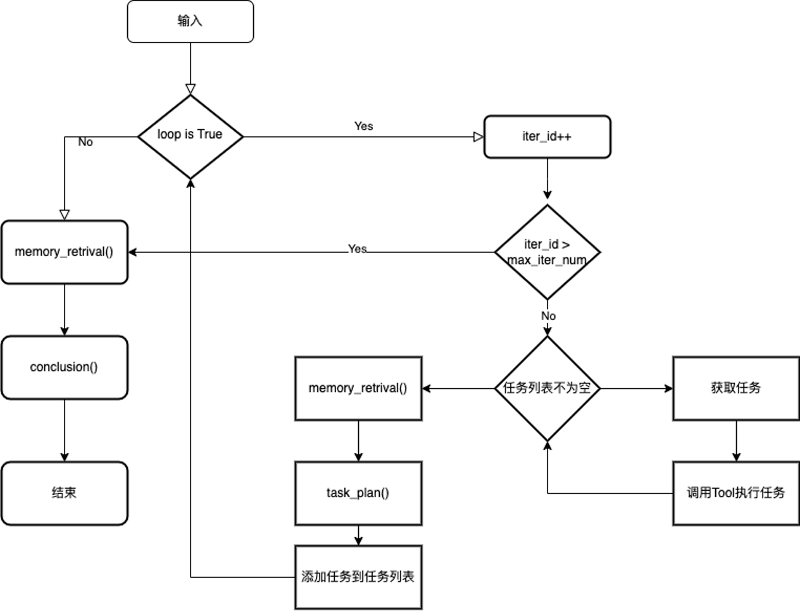

## Agent实现

KAgentSysLite提供 tool_retrival、memory_retrival、task_plan、chat、conclusion等功能。

Chat函数的核心逻辑为：
+ 如果task_storage不为空的话，从任务队列中取任务，根据command来执行tool。否则，调用 memory_retrival 从history和complete_task_list获取新的memory数据；调用task_plan进行任务规划，获取新的任务，并将新任务添加到 task_storage中
+ 循环执行上述流程，直到loop结束
+ 先调用memory_retrival 获取memory；然后调用conclusion，完成对话。

整体阶段分为：thinking+conclusion。Memory用来记录会话历史和任务列表。

对应的流程图为：

github地址： https://github.com/KwaiKEG/KwaiAgents