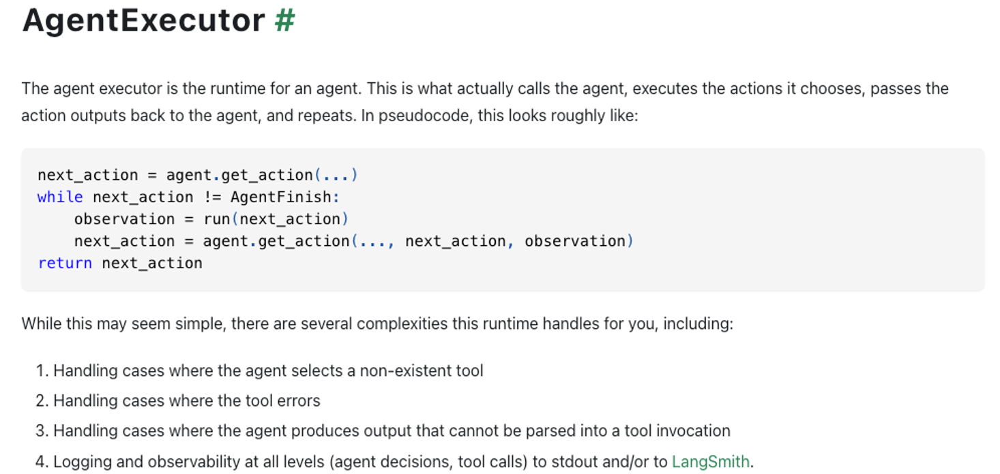

# LangChain

LangChain是开发LLM应用的框架，简化了LLM应用lifecycle的每个阶段。
+ 开发阶段：langchain，langgraph
+ 生产阶段：LangSmith

langchain-core提供了核心抽象和LangChain Expression Language
langchain-community提供第三方集成
langchain提供了Chains、agents和RAG
LangGraph：通过graph来建模Agent逻辑，从而构建有状态的多actor应用
LangServe：部署LangChain为REST apis
LangSmith：debug、test、evaluate和monitor LLM应用

LangChain Expression Language 可以创建任意自定义的Chains，它构建在 Runnable 协议上。
核心的模块包括：
+ Prompt Templates
+ Example Selectors
+ Chat Models
+ Messages
+ Output parsers
+ Document Loaders
+ Text Splitters
+ Embedding models
+ Retrievers
+ Vector stores
+ Indexing
+ Tools
+ MultiModal
+ Agents
+ Callbacks

## Agent

## Langchain Agent

1. 定义Tool：按照langchain的规范
2. 创建Agent：选择需要的agent类型，比如openai-functions-agent
3. 创建AgentExecutor：组合agent和tools
4. 运行agent：调用executor的invoker方法
   + 可以支持会话历史

OpenAI Tools: agent=llm+tools（通过Runabble进行组合的）

AgentExecutor：核心组件，如何运行Agent
+ 开始
+ 中间步骤
+ 结束Finish

AgentExecutor继承Chain
+ 复用invoke方法
+ 新增stream方法

AgentExecutor流程：

### AgentSchema

AgentAction：表示agent所采取的action

AgentFinish：表示agent的最终结果，准备用来返回给用户

Intermediate Steps：中间步骤

AgentExecutor：agent的运行时

Tools Schema

### AgentType

计划的模型类型：
支持会话历史
支持多输入的Tools
支持并行函数调用
需要模型参数