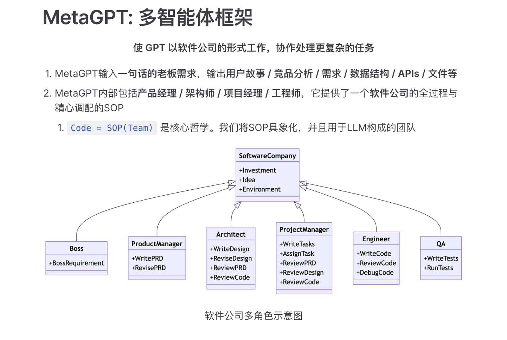
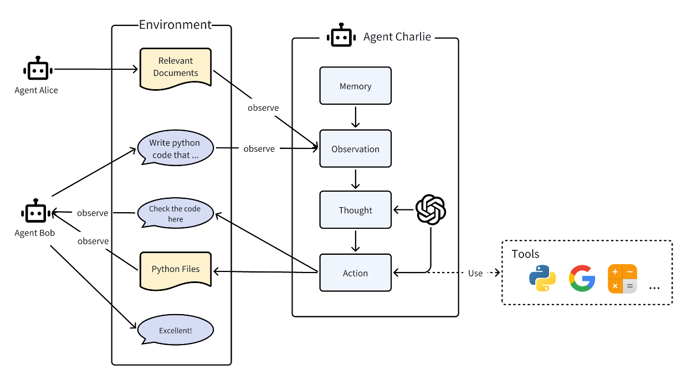

## MetaGPT

多智能体框架：为了处理复杂任务，将不同的角色分配给GPT模型，形成一个协作性软件公司。

学术界和工业界对术语“智能体”提出了各种定义。大致来说，一个智能体应具备类似人类的思考和规划能力，拥有记忆甚至情感，并具备一定的技能以便与环境、智能体和人类进行交互。

在MetaGPT看来，可以将智能体想象成环境中的数字人，其中

智能体 = 大语言模型（LLM） + 观察 + 思考 + 行动 + 记忆

这个公式概括了智能体的功能本质。为了理解每个组成部分，让我们将其与人类进行类比：

大语言模型（LLM）：LLM作为智能体的“大脑”部分，使其能够处理信息，从交互中学习，做出决策并执行行动。
观察：这是智能体的感知机制，使其能够感知其环境。智能体可能会接收来自另一个智能体的文本消息、来自监视摄像头的视觉数据或来自客户服务录音的音频等一系列信号。这些观察构成了所有后续行动的基础。
思考：思考过程涉及分析观察结果和记忆内容并考虑可能的行动。这是智能体内部的决策过程，其可能由LLM进行驱动。
行动：这些是智能体对其思考和观察的显式响应。行动可以是利用 LLM 生成代码，或是手动预定义的操作，如阅读本地文件。此外，智能体还可以执行使用工具的操作，包括在互联网上搜索天气，使用计算器进行数学计算等。
记忆：智能体的记忆存储过去的经验。这对学习至关重要，因为它允许智能体参考先前的结果并据此调整未来的行动。

智能体系统可以视为一个智能体社会，其中

多智能体 = 智能体 + 环境 + 标准流程（SOP） + 通信 + 经济

这些组件各自发挥着重要的作用：

智能体：在上面单独定义的基础上，在多智能体系统中的智能体协同工作，每个智能体都具备独特有的LLM、观察、思考、行动和记忆。
环境：环境是智能体生存和互动的公共场所。智能体从环境中观察到重要信息，并发布行动的输出结果以供其他智能体使用。
标准流程（SOP）：这些是管理智能体行动和交互的既定程序，确保系统内部的有序和高效运作。例如，在汽车制造的SOP中，一个智能体焊接汽车零件，而另一个安装电缆，保持装配线的有序运作。
通信：通信是智能体之间信息交流的过程。它对于系统内的协作、谈判和竞争至关重要。
经济：这指的是多智能体环境中的价值交换系统，决定资源分配和任务优先级。

## 示例

这是一个简单的例子，展示了智能体如何工作：在环境中，存在三个智能体Alice、Bob和Charlie，它们相互作用。
他们可以将消息或行动的输出结果发布到环境中，同时也会被其他智能体观察到。

下面将揭示智能体Charlie的内部过程，该过程同样适用于Alice和Bob。
在内部，智能体Charlie具备我们上述所介绍的部分组件，如LLM、观察、思考、行动。Charlie思考和行动的过程可以由LLM驱动，并且还能在行动的过程中使用工具。
Charlie观察来自Alice的相关文件和来自Bob的需求，获取有帮助的记忆，思考如何编写代码，执行写代码的行动，最终发布结果。
Charlie通过将结果发布到环境中以通知Bob。Bob在接收后回复了一句赞美的话。

## 源码分析

核心抽象：
+ Action，提供了aask、run等方法，通常需要重写 run() 方法
+ Role，等价于Agent，提供`react_mode`；通常需要重写`_act`方法
  + Role React支持三种模式：REACT、BY_ORDER、PLAN_AND_ACT
  + think、act、todo、react、run

agent之间的通信策略是什么？Role之间是平等的，Role可以watch Action
Set strategy of the Role reacting to observed Message. Variation lies in how
this Role elects action to perform during the _think stage, especially if it is capable of multiple Actions.

Team: Possesses one or more roles (agents), SOP (Standard Operating Procedures), and a env for instant messaging,
    dedicated to env any multi-agent activity, such as collaboratively writing executable code.
团队：拥有一个或多个角色（代理）、SOP（标准操作程序）和一个用于即时消息传递的环境，专用于任何多代理活动所需的环境，例如协作编写可执行代码。
+ env:环境
+ investment：投资金额
+ idea: 想法，需求
+ hire
+ invest

Environment: 环境，承载一批角色，角色可以向环境发布消息，可以被其他角色观察到

## 应用

单智能体：
1. 摄影师：根据提示词生成图像
2. 机器学习工程师：分析、可视化数据集和建模
3. 调研员：从网络进行搜索并总结报告
4. 收据助手：从收据中提取结构信息

多智能体：
1. 软件公司
2. 辩论
3. 狼人杀
4. 虚拟小镇

## 总结

MetaGPT：自顶向下来构建：预先已经存在Team，组织各种角色来完成任务。

