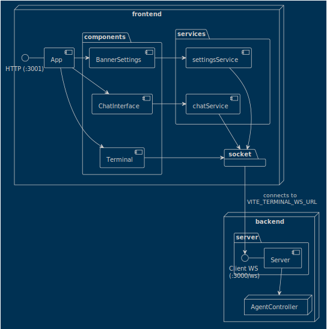
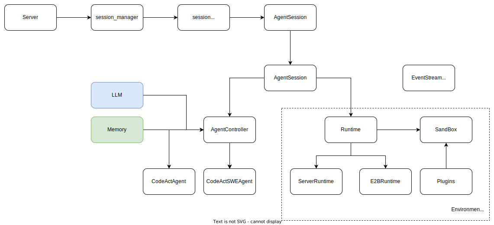

## 简介

> 开源 Devin，一个能够执行复杂工程任务并与用户积极合作进行软件开发项目的 AI 软件工程师

OpenDevin是一套Agent框架，

> Agent核心架构没有变化，重点在于内部的设计有所不同

server -> AgentSession -> AgentController -> Agent

AgentController 等价于 AgentExecutor

## 架构图

## 系统架构

+ agentController
+ Agent
+ Plan: input
+ State: memory
+ Action: 工具的输入
+ Observation

目前，我们的默认代理是 CodeActAgent，它能够生成代码和处理文件。我们正在开发其他代理实现，包括SWE Agent。

controller:
+ 定义了Agent、ActionParser的抽象接口
+ AgentController：负责控制Agent的运行，跟踪Agent的运行状态（metrics），记录Agent的State（history、updated_info）
+ 设计原理：
+ EventStream：基于Event Stream的发布订阅

events: 设计了基于pub/sub的EventStream
+ 定义了

memory: 提供了Condenser、history(ShortTermHistory)、memory(long term memory)三种

runtime: agent与外部env如何交互，包括bash sandbox、browser、filesystem交互
+ browser
+ docker
+ e2b
+ plugins
+ server

agentHub: 内置了很多Agent，服务启动会自动注册到全局Agent

> 总结: AgentController设计了一套新的控制流程；EventStream提供了针对不同订阅者的回调函数栈；

## 用例

实现了3类Agent：
+ CodeAct Agent
+ Monologue Agent: 利用长短期记忆来完成任务
+ Planner Agent: 利用特殊的prompt策略来创建长期plan来解决问题

1. BrowsingAgent：与 Browser 交互的Agent
2. CodeActAgent
3. CodeActSWEAgent：用来解决 Github issues
4. DelegatorAgent
5. micro-agents：包括多个Agent。彼此之间存在委派关系，可以由ManagerAgent来委派
6. MonologueAgent：利用长短期记忆来完成任务
7. PlannerAgent：利用特殊的prompt工程创建plan来解决问题
8. SWEAgent：将 LM（例如 GPT-4）转变为软件工程代理，可以修复真实 GitHub 代码库中的bug和issue。

## 核心流程

## 架构设计的优点以及缺点

1. 架构简洁，高内聚，低耦合
2. 高效地利用jinja来render prompt；相比langchain的prompt设计，该方案简单；
3. 扩展性：基于EventStream的设计，可以将Agent扩展到分布式系统中（未实现）

## 启发点

使用 LLM 实现生产级应用程序的完全复制是一项复杂的工作。我们的策略包括：

+ 核心技术研究：专注于基础研究，以了解和改进代码生成和处理的技术方面。
+ 专业能力：通过数据管理、训练方法等提高核心组件的有效性。
+ 任务规划：开发错误检测、代码库管理和优化的能力。
+ 评估：建立全面的评估指标，以更好地理解和改进我们的模型。

Core Technical Research: Focusing on foundational research to understand and improve the technical aspects of code generation and handling.
Specialist Abilities: Enhancing the effectiveness of core components through data curation, training methods, and more.
Task Planning: Developing capabilities for bug detection, codebase management, and optimization.
Evaluation: Establishing comprehensive evaluation metrics to better understand and improve our models.

## 参考

1. https://github.com/ServiceNow/BrowserGym : a gym environment for web task automation in the Chromium browser.
