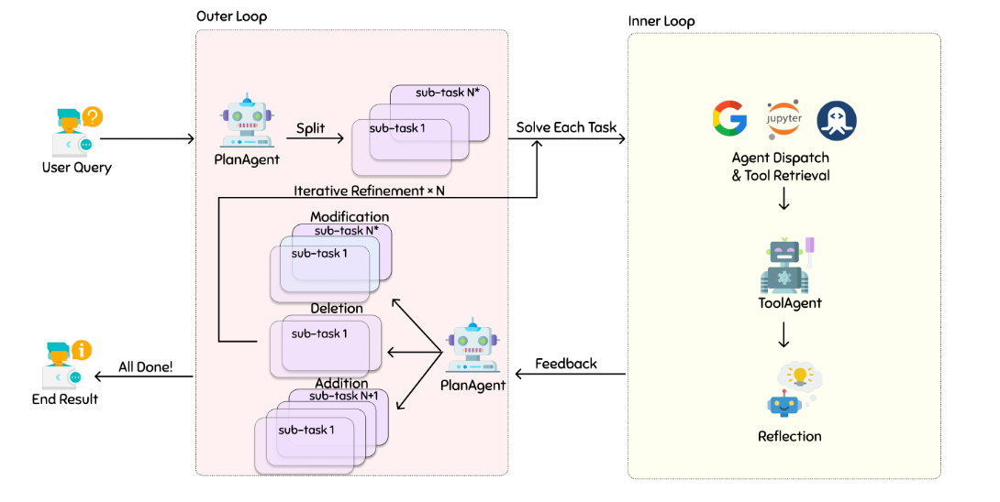

XAgent采用双循环机制：外循环用于高层任务管理，内循环用于低层任务执行。外环流程使代理能够识别总体任务并将其分割为更小、更可操作的组件。
在XAgent中，决策和任务执行过程是通过双循环机制来协调的：外循环和内循环。本质上，外循环处理任务的高层管理和分配，内循环专注于各个子任务的低层执行和优化。
+ PlanAgent: 动态规划和迭代细化
+ ToolAgent：在函数调用中协同推理和行动



### 数据结构

node、plan、tree为什么设计为树形结构呢。

ToolNode是树形结构

### ToolAgent

继承BaseAgent来实现

ToolAgent通过FunctionManager来管理以及调用函数

FunctionManager提供了管理function的方法，包括注册和执行，这些方法通过yaml文件来加载或定义在本地目录

### XAgent

XAgent 内置了一些`ai_function`函数，包括：`functions`、`pure_function`、`requests`

函数描述用yaml文件进行保存

ai_functions: OBJGenerator，处理与AI Response之间的交互，并执行请求
OBJGenerator是如何执行function call.

```
XAgent.ai_functions.requests.agent
```

FunctionManager类是Function管理的入口。

`function_handler.py FunctionHandler处理ToolServer和interaction、以及其他function。

### ToolServer

toolserver_interface.py文件中`execute_command_client`方法是调用ToolServer接口来执行command

### XAgentGen

## 参考

1. https://blog.x-agent.net/blog/xagent/
