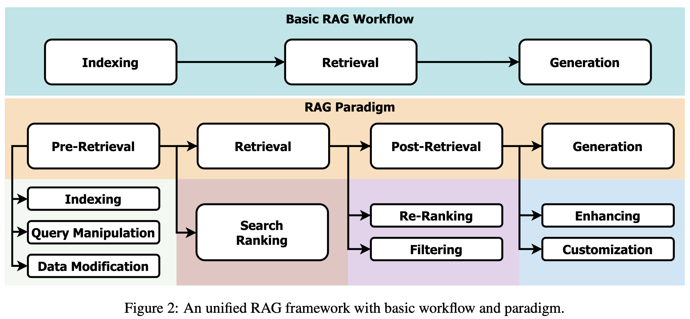
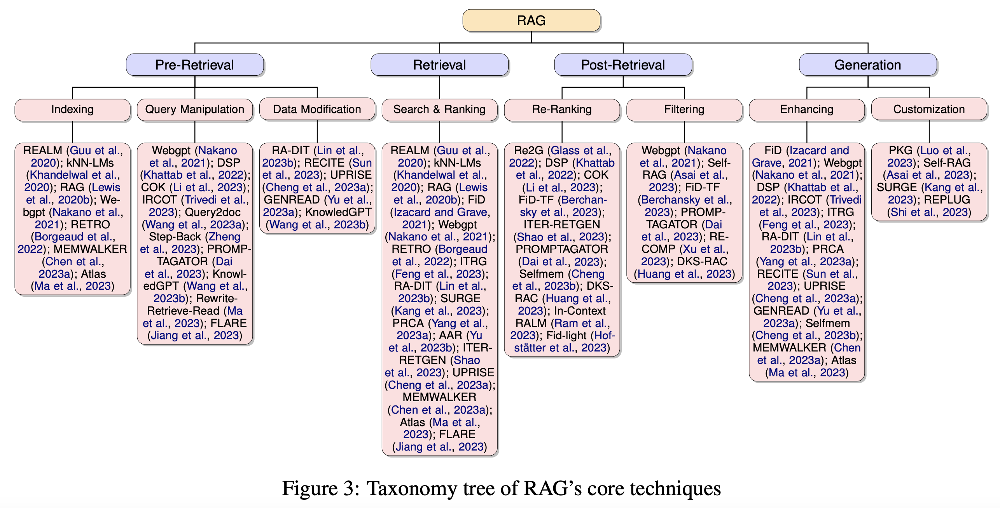
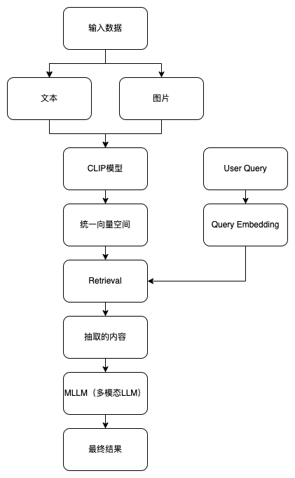
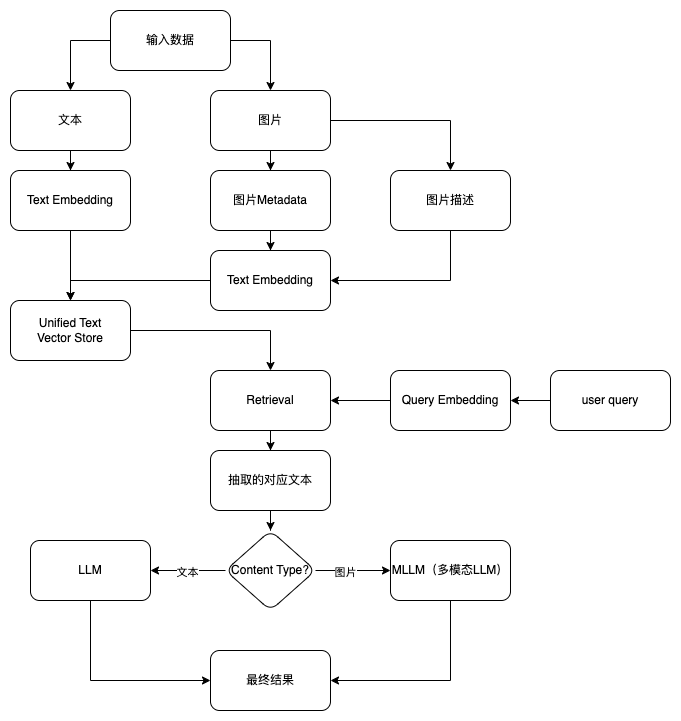
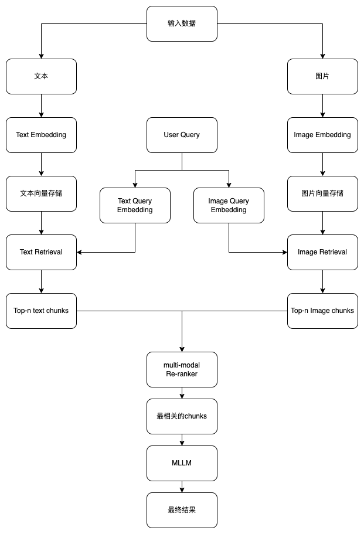

# RAG（Retrieval Augmented Generation）

根据信息编码方法，检索方法通常可分为稀疏(sparse)和密集(dense)两类：
+ 稀疏检索基于词，主要用于文本检索；
+ 密集检索将查询和外部知识嵌入到向量空间中，可应用于各种数据格式。可以通过语义相似度进行检索

### 检索增强生成相关的综述paper

>  [A Survey on Retrieval-Augmented Text Generation for Large Language Models](https://arxiv.org/pdf/2404.10981)

this paper organizes the RAG paradigm into four categories: pre-retrieval, retrieval, post-retrieval, and generation,
offering a detailed perspective from the retrieval viewpoint.(从检索视角提供了详细的视角）

RAG combines retrieval methods and advanced
deep learning to address two main questions: effectively retrieving relevant information and generating accurate responses

RAG范式如图：

RAG核心技术列表： 

>  [Retrieval-Augmented Generation for Large Language Models: A Survey](https://arxiv.org/pdf/2312.10997)

详细中文版见：[链接](https://www.promptingguide.ai/zh/research/rag)

github地址：https://github.com/Tongji-KGLLM/RAG-Survey

> [Modular RAG: Transforming RAG Systems into LEGO-like Reconfigurable Frameworks](https://arxiv.org/html/2407.21059)

检索增强生成 (RAG) 显著增强了大型语言模型 (LLM) 处理知识密集型任务的能力。应用场景的需求不断增长推动了 RAG 的演进，从而集成了高级检索器、LLM 和其他互补技术，这反过来又增加了 RAG 系统的复杂性。
然而，快速的发展正在超越基础 RAG 范式，许多方法在“检索然后生成”的流程下难以统一。在此背景下，本文研究了现有 RAG 范式的局限性，并介绍了模块化 RAG 框架。
通过将复杂的 RAG 系统分解为独立的模块和专门的操作符，它有助于实现高度可重构的框架。模块化 RAG 超越了传统的线性架构，采用了一种集成路由、调度和融合机制的更高级设计。
本文基于广泛的研究，进一步确定了流行的 RAG 模式 ———— 线性、条件、分支和循环，并全面分析了它们各自的实现细节。模块化 RAG 为 RAG 系统的概念化和部署提供了创新机会。
最后，本文探讨了新运算符和新范式的潜在出现，为 RAG 技术的持续发展和实际部署奠定了坚实的理论基础和实用路线图。

模块化的RAG刚好满足当前RAG系统的需求，如图所示：

### 多模态RAG的几种实现方案

方案一：将文本和图片通过 [CLIP](https://github.com/openai/CLIP) 之类的模型处理为文本基础模态

> CLIP(Contrastive Language-Image Pretraining)模型，通过文本和图像Contrastive进行预训练，可以根据图像预测最相关的文本

方案二：统一的向量空间，将图片信息统一处理为文本

方案三：使用不同的向量存储

实际应用中，由于MLLM能力的限制，我们实际落地的流程类似方案二。

### 参考

1. [Multi-modal RAG: Chat with Docs containing Images](https://www.youtube.com/watch?v=Rg35oYuus-w)

